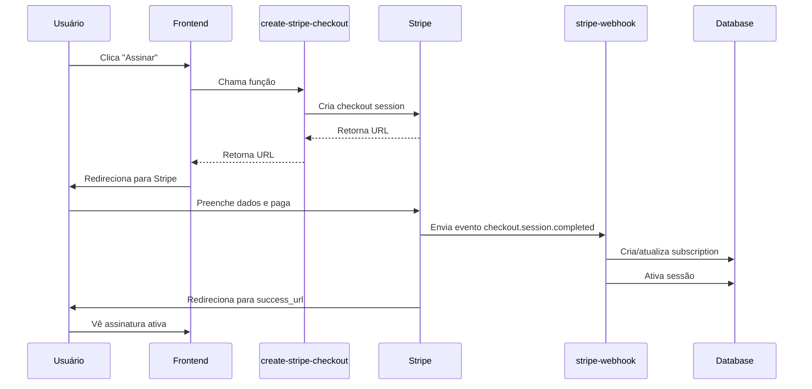

# 🚀 Setup Completo - Stripe Integration

## ✅ Status da Implementação

### Código Implementado
- ✅ Edge Function: `create-stripe-checkout` 
- ✅ Edge Function: `stripe-webhook`
- ✅ Edge Function: `create-stripe-portal`
- ✅ Frontend atualizado: `Checkout.tsx`
- ✅ Frontend atualizado: `Subscriptions.tsx`
- ✅ Config: `supabase/config.toml`

### Secrets Configurados
- ✅ `STRIPE_SECRET_KEY`
- ✅ `STRIPE_WEBHOOK_SECRET`

### Dados do Stripe
- **Price ID:** `price_1SUdTIR7psEPMC6HkuaEUrwS`
- **Publishable Key:** `pk_live_51SUd0uQs5BDRSUmXuMl0zDq09GyaDhaJ31UgzAitwsUf6byz9du7b2DOiOJrbE3CIVOExSk8IBvv81XF2Osle3Nf00L353LYfm`

---

## 📋 Próximos Passos

### 1️⃣ Executar Migração SQL (OBRIGATÓRIO)

Execute o arquivo `STRIPE_MIGRATION.sql` no Supabase:

1. Acesse: https://supabase.com/dashboard/project/kfsvpbujmetlendgwnrs/sql/new
2. Cole o conteúdo do arquivo `STRIPE_MIGRATION.sql`
3. Clique em **"Run"**
4. Verifique se aparecem as mensagens de sucesso

### 2️⃣ Configurar Webhook no Stripe Dashboard (OBRIGATÓRIO)

1. Acesse: https://dashboard.stripe.com/webhooks

2. Clique em **"Add endpoint"**

3. Configure:
   - **Endpoint URL:** 
     ```
     https://kfsvpbujmetlendgwnrs.supabase.co/functions/v1/stripe-webhook
     ```
   - **Descrição:** `Webhook Uplink - Gerenciar assinaturas`
   
4. Selecione os eventos:
   - ✅ `checkout.session.completed`
   - ✅ `customer.subscription.updated`
   - ✅ `customer.subscription.deleted`
   - ✅ `invoice.payment_failed`

5. Clique em **"Add endpoint"**

6. ✅ **O Signing Secret já foi configurado** (você já fez isso)

### 3️⃣ Testar a Implementação

#### Teste Básico
1. Ir no Dashboard
2. Criar nova sessão: `teste-stripe-01`
3. Clicar em "Assinar"
4. Verificar se abre o Stripe Checkout

#### Dados de Teste
- **Email:** `teste@exemplo.com`
- **Cartão:** `4242 4242 4242 4242`
- **Data:** `12/25` (qualquer data futura)
- **CVV:** `123`
- **Nome:** `Teste Stripe`
- **CEP:** `12345-678`

#### Verificações Pós-Pagamento
- ✅ Redireciona para `/dashboard?payment=success`
- ✅ Sessão aparece como "Ativa"
- ✅ Em "Assinaturas", status mostra "Ativa"
- ✅ Botão "Gerenciar Assinatura" funciona

#### Testar Customer Portal
1. Ir em "Assinaturas"
2. Clicar em "Gerenciar Assinatura"
3. ✅ Abre portal do Stripe
4. ✅ Possível ver detalhes
5. ✅ Possível cancelar (em sandbox)

### 4️⃣ Verificar Logs

#### Edge Function Logs
- **create-stripe-checkout:** https://supabase.com/dashboard/project/kfsvpbujmetlendgwnrs/functions/create-stripe-checkout/logs
- **stripe-webhook:** https://supabase.com/dashboard/project/kfsvpbujmetlendgwnrs/functions/stripe-webhook/logs
- **create-stripe-portal:** https://supabase.com/dashboard/project/kfsvpbujmetlendgwnrs/functions/create-stripe-portal/logs

#### Webhook Logs no Stripe
- https://dashboard.stripe.com/webhooks → Clique no endpoint criado → Ver eventos

---

## 🎯 Fluxo Completo



---

## 🔧 Troubleshooting

### Erro: "Webhook signature verification failed"
**Solução:** Verifique se o `STRIPE_WEBHOOK_SECRET` está correto

### Erro: "Price not found"
**Solução:** Verifique se o Price ID `price_1SUdTIR7psEPMC6HkuaEUrwS` está ativo no Stripe

### Assinatura não aparece após pagamento
**Solução:** 
1. Verifique logs do webhook
2. Confirme que o evento foi recebido no Stripe Dashboard
3. Verifique tabela `subscriptions` no Supabase

### Botão "Gerenciar Assinatura" desabilitado
**Solução:** A assinatura precisa ter `stripe_customer_id` preenchido. Isso acontece após o webhook processar o pagamento.

---

## 📊 Comparação: Antes vs Depois

| Aspecto | Mercado Pago | Stripe |
|---------|--------------|--------|
| **Coleta de dados** | Você coleta CPF, endereço, cartão | Stripe coleta tudo |
| **Aprovação** | ~60-70% | ~85-90% |
| **Portal do cliente** | Link externo genérico | Portal nativo integrado |
| **Segurança** | Você gerencia dados sensíveis | Stripe gerencia tudo |
| **Internacional** | América Latina | 135+ países |
| **Código** | ~590 linhas | ~379 linhas |

---

## 🎁 Benefícios Implementados

✅ **Menos código** - 211 linhas a menos  
✅ **Mais seguro** - Dados sensíveis ficam no Stripe  
✅ **Melhor UX** - Checkout otimizado e em português  
✅ **Customer Portal** - Usuário gerencia sozinho  
✅ **Webhooks assinados** - Segurança máxima  
✅ **Pronto para global** - Suporta 135+ países  

---

## 📝 Checklist Final

Antes de marcar como concluído:

- [ ] SQL migration executada
- [ ] Webhook configurado no Stripe Dashboard
- [ ] Testado com cartão de teste `4242 4242 4242 4242`
- [ ] Sessão aparece como ativa após pagamento
- [ ] Customer Portal abre e funciona
- [ ] Logs verificados (sem erros)
- [ ] Assinatura aparece na página "Assinaturas"

---

## 🚨 IMPORTANTE

### Assinaturas Antigas (Mercado Pago)
As assinaturas existentes do Mercado Pago **continuarão funcionando normalmente**. O sistema agora suporta ambos os provedores simultaneamente.

### Novas Assinaturas
Todas as novas assinaturas **usarão Stripe automaticamente**.

### Migração Futura (Opcional)
Se desejar migrar assinaturas antigas do Mercado Pago para Stripe, entre em contato para um plano de migração.

---

## 📞 Suporte

Em caso de dúvidas ou problemas:
1. Verifique os logs das Edge Functions
2. Verifique eventos no Stripe Dashboard
3. Verifique dados na tabela `subscriptions`

---

**Implementação completa! 🎉**
